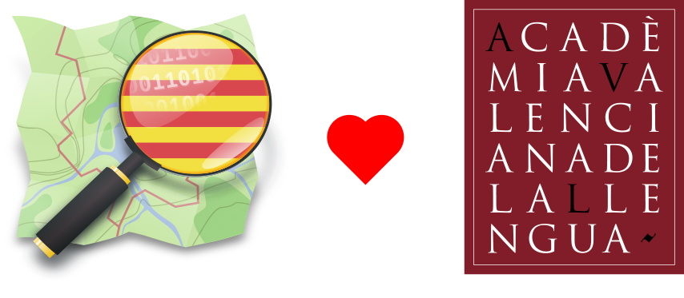

<!-- README.md is generated from README.Rmd. Please edit that file -->

```{r, include = FALSE}
knitr::opts_chunk$set(
  collapse = TRUE,
  comment = "#>",
  fig.path = "man/figures/README-",
  out.width = "100%"
)
```

# avl.osm 

<!-- badges: start -->
<!-- [](https://github.com/OSM-Catalan/avl.osm/actions/workflows/pre-commit.yaml) -->
<!-- [](https://github.com/OSM-Catalan/avl.osm/actions/workflows/R-CMD-check.yaml) -->
<!-- [](https://github.com/OSM-Catalan/avl.osm/actions/workflows/test-coverage.yaml) -->
<!-- badges: end -->

`avl.osm` és un repositori que serveix per coordinar la col·laboració entre
l'[Acadèmia Valenciana de la Llengua](https://www.avl.gva.es) (AVL) i [OpenStreetMap](https://openstreetmap.org) (OSM)
arran de 
l'[autoritzada la reutilització de les dades de l'AVL](https://wiki.openstreetmap.org/wiki/File:AVL_autoritza.jpg).

